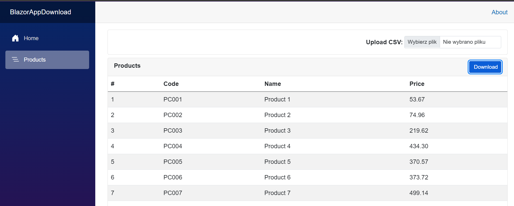

# 🌟 BlazorAppDownload 🌟



Hey there! 👋

Introducing my BlazorAppDownload application! 🚀 Built using **Blazor** in **.NET 8** 💻, this app is simply epic! 🤩

## What does it do? 🤔

- 📥 **Load data from a CSV file to MS SQL Database**: Upload your data in a flash! ⚡
- 📤 **Download data from the database**: Click the **Download** button and boom! 💥 You've got your CSV file ready to go! 🎉

## Technologies 🛠️

- **Blazor** ❤️
- **Entity Framework Core** 🧐
- **SQL Server** 🗄️
- **.NET 8** 🚀

## Configuration 📝

The database connection is cleverly stored in the `appsettings.json` file! 🕵️

## How to get started? 🚀

1. **Clone** the repository 🍴
2. Configure `appsettings.json` 📝
3. Run the application and have fun! 🎉
4. Use `sample_products.csv` from repository
---

## Setting Up SQL Server in Docker 🐋

To make it easy for you to get started with SQL Server, here’s a quick guide to set it up using Docker.

### Step 1: Pull the SQL Server Docker Image 📥

Open your terminal and run the following command to pull the SQL Server 2022 image:

```bash
docker pull mcr.microsoft.com/mssql/server:2022-latest
```
### Step 2: Run the SQL Server Container 🏃
Once the image is pulled, start the SQL Server container with the command below:

```bash
docker run -e "ACCEPT_EULA=Y" -e "SA_PASSWORD=YourStrong!Password" -p 1433:1433 --name sql2022container -d mcr.microsoft.com/mssql/server:2022-latest
```
### Step 3: Connect to SQL Server 🗄️
To connect to the running SQL Server instance, use the sqlcmd tool. Run the following command:
```bash
sqlcmd -S localhost,1433 -U SA -P "YourStrong!Password"
```
This will connect you to the SQL Server instance running in your Docker container.

### Step 4: Create a Database 🛠️
After connecting to SQL Server, you can create a new database with the following SQL command:
```bash
CREATE DATABASE TestDB;
GO
```
Type EXIT to leave the sqlcmd prompt after creating the database.


